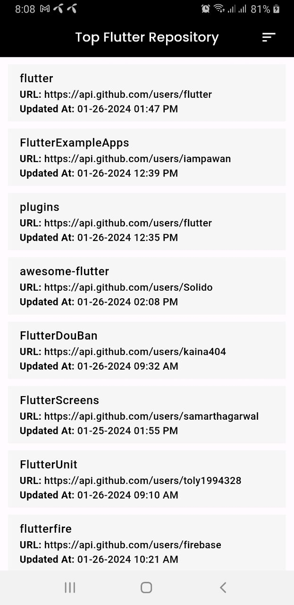
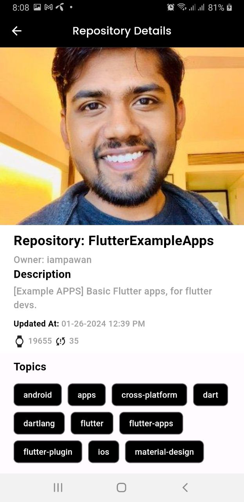
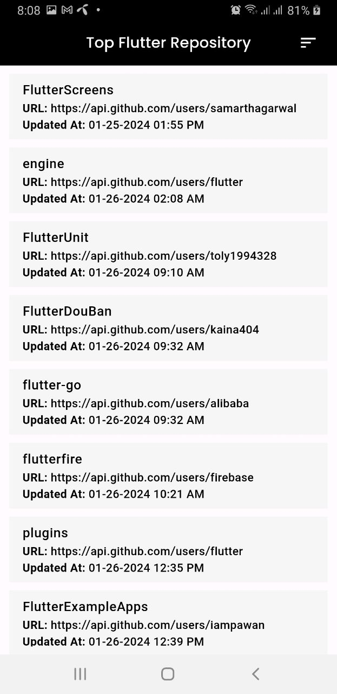

# Top Flutter Repositories

I developed a simple Flutter application that displays the most-starred GitHub repositories using the keyword 'Flutter.'It is built with the widely acclaimed state management approach, Bloc, and utilizes the local database Hive.


## Table of Contents
- [Screenshots](#screenshots)
- [Project Architecture](#project-architecture)
- [Flavor Setup using --dart-define](#Flavor)


## Screenshots
Include some screenshots of your application to give users a visual preview.


*Initial Flutter Repository List*

*Repository Details*

*Offline Mode Browsing*

*Sort By Updatetime*

## Project Architecture
Here's a step-by-step explanation about my project architecture:

# API Client:
My application starts by making a request to an external server to fetch data. This is handled by the API client.
# NetworkRequestBuilder:
The API client uses the NetworkRequestBuilder to construct and configure the details of the network request. The builder pattern is used to make the construction of complex request objects more flexible and customizable.
# Repository:
Once the request is built, it is passed to the repository. The repository acts as an abstraction layer between the data source (for remote in this case, the API client and local which i used Hive database).
The repository contains methods that define the data-fetching logic. These methods use the API client's request to fetch data from the server.
# Abstract Class:
Abstract class likely defines a set of methods or an interface that how data should be processed or handled.
# Bloc (Business Logic Component):
The processed data from the repository is then sent to the Bloc. A Bloc is responsible for managing the business logic of your application. It acts as an intermediary between the repository (which fetches data) and the UI components.
The Bloc can transform the raw data received from the repository into a format that is suitable for presentation in the user interface. It may also handle events and state management.
# UI Components:
Finally, the transformed or processed data from the Bloc is sent to the UI components (e.g., widgets in Flutter). These UI components render the data, allowing the user to interact with the information fetched from the server.

## Flavor Setup using --dart-define

Here, I am implementing a custom flavor setup created using --dart-define. You can effortlessly build the APK by passing the value using --dart-define from the terminal. In this setup, I have configured three modes: DEV/QA/PROD.

```
flutter build apk --dart-define=mode=DEV

```


